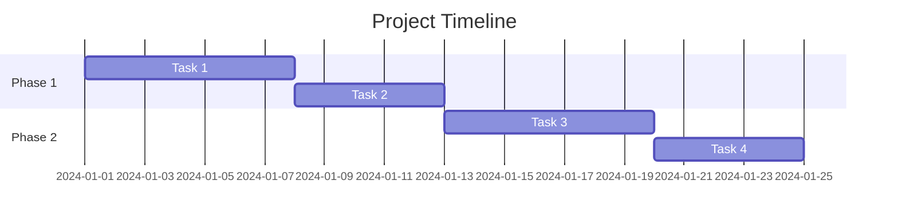

# Plan Mode Skill

This skill creates ultra-detailed implementation plans for software projects, features, applications, and technical initiatives. Plans are structured with phases, milestones, dependencies, risk assessments, and actionable steps that can be directly executed.

## Planning Philosophy

### Core Principles

1. **Actionable** - Every step can be directly executed
2. **Measurable** - Clear success criteria for each phase
3. **Realistic** - Account for real-world constraints
4. **Comprehensive** - Cover all aspects without gaps
5. **Flexible** - Allow for iteration and adjustment

### Plan Quality Standards

- Each task has clear deliverables
- Dependencies are explicitly mapped
- Risks are identified with mitigations
- Time estimates are realistic
- Success criteria are measurable

## Plan Structure

### Standard Plan Format

```markdown
# [Project/Feature Name] Implementation Plan

## Executive Summary
[2-3 sentences describing what will be built and the expected outcome]

## Goals & Success Criteria
### Primary Goals
- [ ] Goal 1
- [ ] Goal 2

### Success Metrics
| Metric | Target | Measurement Method |
|--------|--------|-------------------|
| [Metric] | [Target] | [How to measure] |

## Scope Definition
### In Scope
- [Item 1]
- [Item 2]

### Out of Scope
- [Item 1]
- [Item 2]

### Assumptions
- [Assumption 1]
- [Assumption 2]

## Technical Overview
### Architecture
[High-level architecture description]

### Technology Stack
- Frontend: [technologies]
- Backend: [technologies]
- Database: [technologies]
- Infrastructure: [technologies]

### Key Dependencies
- [Dependency 1]
- [Dependency 2]

---

## Phase 1: [Phase Name]
**Duration:** [X days/weeks]
**Goal:** [What this phase accomplishes]

### Milestones
- [ ] Milestone 1.1: [Description]
- [ ] Milestone 1.2: [Description]

### Tasks

#### 1.1 [Task Group Name]
| # | Task | Est. Time | Priority | Dependencies |
|---|------|-----------|----------|--------------|
| 1.1.1 | [Task description] | [time] | High/Med/Low | None |
| 1.1.2 | [Task description] | [time] | High/Med/Low | 1.1.1 |

**Deliverables:**
- [ ] [Deliverable 1]
- [ ] [Deliverable 2]

**Acceptance Criteria:**
- [ ] [Criterion 1]
- [ ] [Criterion 2]

---

## Phase 2: [Phase Name]
[Same structure as Phase 1]

---

## Risk Assessment

| Risk | Probability | Impact | Mitigation |
|------|-------------|--------|------------|
| [Risk 1] | High/Med/Low | High/Med/Low | [Strategy] |
| [Risk 2] | High/Med/Low | High/Med/Low | [Strategy] |

## Timeline Overview

```
Week 1-2: Phase 1 - [Name]
Week 3-4: Phase 2 - [Name]
Week 5:   Phase 3 - [Name]
Week 6:   Testing & Launch
```

## Resource Requirements
- [Resource 1]
- [Resource 2]

## Open Questions
- [ ] [Question 1]
- [ ] [Question 2]

## Next Steps
1. [Immediate action 1]
2. [Immediate action 2]
```

## Planning Templates by Project Type

### New Application Plan

```markdown
# [App Name] Development Plan

## Vision
[What the app does and why it matters]

## Target Users
[Who will use this and their key needs]

---

## Phase 1: Foundation (Week 1-2)
**Goal:** Set up project infrastructure and core architecture

### 1.1 Project Setup
| # | Task | Time | Notes |
|---|------|------|-------|
| 1.1.1 | Initialize repository with proper structure | 2h | |
| 1.1.2 | Set up development environment | 2h | |
| 1.1.3 | Configure linting, formatting, pre-commit hooks | 2h | |
| 1.1.4 | Set up CI/CD pipeline | 4h | |
| 1.1.5 | Create README and documentation structure | 2h | |

### 1.2 Architecture Setup
| # | Task | Time | Notes |
|---|------|------|-------|
| 1.2.1 | Design database schema | 4h | |
| 1.2.2 | Set up database and ORM | 3h | |
| 1.2.3 | Create base API structure | 4h | |
| 1.2.4 | Set up authentication system | 6h | |
| 1.2.5 | Configure environment management | 2h | |

### 1.3 Frontend Foundation
| # | Task | Time | Notes |
|---|------|------|-------|
| 1.3.1 | Initialize frontend project | 2h | |
| 1.3.2 | Set up component library/design system | 4h | |
| 1.3.3 | Configure routing | 2h | |
| 1.3.4 | Set up state management | 3h | |
| 1.3.5 | Create layout components | 4h | |

**Phase 1 Deliverables:**
- [ ] Working dev environment
- [ ] CI/CD pipeline running
- [ ] Database schema implemented
- [ ] Auth system functional
- [ ] Basic app shell rendering

---

## Phase 2: Core Features (Week 3-4)
**Goal:** Implement primary functionality

### 2.1 [Core Feature 1]
| # | Task | Time | Notes |
|---|------|------|-------|
| 2.1.1 | Design API endpoints | 2h | |
| 2.1.2 | Implement backend logic | 8h | |
| 2.1.3 | Create frontend components | 8h | |
| 2.1.4 | Connect frontend to API | 4h | |
| 2.1.5 | Write tests | 4h | |

### 2.2 [Core Feature 2]
[Similar structure]

### 2.3 [Core Feature 3]
[Similar structure]

**Phase 2 Deliverables:**
- [ ] Core feature 1 complete
- [ ] Core feature 2 complete
- [ ] Core feature 3 complete
- [ ] Integration tests passing

---

## Phase 3: Enhancement (Week 5)
**Goal:** Polish and add secondary features

### 3.1 UX Polish
| # | Task | Time | Notes |
|---|------|------|-------|
| 3.1.1 | Add loading states | 3h | |
| 3.1.2 | Implement error handling UI | 3h | |
| 3.1.3 | Add success feedback | 2h | |
| 3.1.4 | Optimize animations | 3h | |
| 3.1.5 | Mobile responsiveness review | 4h | |

### 3.2 Performance
| # | Task | Time | Notes |
|---|------|------|-------|
| 3.2.1 | Database query optimization | 4h | |
| 3.2.2 | Frontend bundle optimization | 3h | |
| 3.2.3 | Add caching where appropriate | 4h | |
| 3.2.4 | Performance testing | 2h | |

---

## Phase 4: Launch Preparation (Week 6)
**Goal:** Ensure production readiness

### 4.1 Testing
| # | Task | Time | Notes |
|---|------|------|-------|
| 4.1.1 | Complete unit test coverage | 4h | |
| 4.1.2 | E2E testing | 6h | |
| 4.1.3 | Security review | 4h | |
| 4.1.4 | Performance testing | 2h | |
| 4.1.5 | Bug fixes | 8h | |

### 4.2 Deployment
| # | Task | Time | Notes |
|---|------|------|-------|
| 4.2.1 | Production environment setup | 4h | |
| 4.2.2 | Database migration scripts | 2h | |
| 4.2.3 | Monitoring setup | 3h | |
| 4.2.4 | Backup configuration | 2h | |
| 4.2.5 | Deploy and verify | 2h | |

### 4.3 Documentation
| # | Task | Time | Notes |
|---|------|------|-------|
| 4.3.1 | API documentation | 3h | |
| 4.3.2 | User guide | 4h | |
| 4.3.3 | Deployment runbook | 2h | |
```

### Feature Implementation Plan

```markdown
# [Feature Name] Implementation Plan

## Feature Overview
**Description:** [What the feature does]
**User Story:** As a [user], I want to [action] so that [benefit]
**Priority:** [High/Medium/Low]

## Impact Analysis
- **Affected Components:** [list]
- **Database Changes:** [Yes/No - details]
- **API Changes:** [Yes/No - details]
- **Breaking Changes:** [Yes/No - details]

---

## Phase 1: Design & Planning (Day 1)

### 1.1 Technical Design
| # | Task | Time |
|---|------|------|
| 1.1.1 | Review existing code and identify touch points | 1h |
| 1.1.2 | Design data model changes | 2h |
| 1.1.3 | Design API contract | 2h |
| 1.1.4 | Design UI/UX flow | 2h |
| 1.1.5 | Document technical approach | 1h |

**Deliverable:** Technical design document

---

## Phase 2: Backend Implementation (Day 2-3)

### 2.1 Database Layer
| # | Task | Time |
|---|------|------|
| 2.1.1 | Create migration files | 1h |
| 2.1.2 | Update models/schemas | 2h |
| 2.1.3 | Add database indexes if needed | 1h |

### 2.2 Business Logic
| # | Task | Time |
|---|------|------|
| 2.2.1 | Implement core service logic | 4h |
| 2.2.2 | Add validation | 2h |
| 2.2.3 | Implement error handling | 1h |

### 2.3 API Layer
| # | Task | Time |
|---|------|------|
| 2.3.1 | Create/update endpoints | 3h |
| 2.3.2 | Add authentication/authorization | 1h |
| 2.3.3 | Write API tests | 2h |

**Deliverable:** Working API endpoints with tests

---

## Phase 3: Frontend Implementation (Day 4-5)

### 3.1 Components
| # | Task | Time |
|---|------|------|
| 3.1.1 | Create new components | 4h |
| 3.1.2 | Update existing components | 2h |
| 3.1.3 | Implement forms and validation | 3h |

### 3.2 Integration
| # | Task | Time |
|---|------|------|
| 3.2.1 | Connect to API | 2h |
| 3.2.2 | Implement state management | 2h |
| 3.2.3 | Add loading/error states | 2h |

### 3.3 Testing
| # | Task | Time |
|---|------|------|
| 3.3.1 | Unit tests for components | 2h |
| 3.3.2 | Integration tests | 2h |

**Deliverable:** Feature fully functional in development

---

## Phase 4: Review & Deploy (Day 6)

### 4.1 Code Review
| # | Task | Time |
|---|------|------|
| 4.1.1 | Create PR with documentation | 1h |
| 4.1.2 | Address review feedback | 2h |

### 4.2 QA
| # | Task | Time |
|---|------|------|
| 4.2.1 | Manual testing | 2h |
| 4.2.2 | Bug fixes | 2h |

### 4.3 Deploy
| # | Task | Time |
|---|------|------|
| 4.3.1 | Deploy to staging | 1h |
| 4.3.2 | Staging verification | 1h |
| 4.3.3 | Deploy to production | 1h |
| 4.3.4 | Production verification | 1h |

**Deliverable:** Feature live in production
```

### Migration/Refactor Plan

```markdown
# [Migration/Refactor Name] Plan

## Overview
**Current State:** [What exists now]
**Target State:** [What we want]
**Motivation:** [Why we're doing this]

## Risk Assessment
| Risk | Impact | Mitigation |
|------|--------|------------|
| Data loss | Critical | Full backup before migration |
| Downtime | High | Blue-green deployment |
| Rollback needed | Medium | Maintain rollback scripts |

---

## Phase 1: Preparation (Week 1)

### 1.1 Analysis
| # | Task | Time |
|---|------|------|
| 1.1.1 | Audit current implementation | 4h |
| 1.1.2 | Document all dependencies | 2h |
| 1.1.3 | Create test baseline | 3h |
| 1.1.4 | Design migration strategy | 4h |

### 1.2 Preparation
| # | Task | Time |
|---|------|------|
| 1.2.1 | Set up feature flags | 2h |
| 1.2.2 | Create staging environment | 3h |
| 1.2.3 | Write migration scripts | 4h |
| 1.2.4 | Create rollback procedures | 3h |

---

## Phase 2: Implementation (Week 2-3)

### 2.1 New Implementation
| # | Task | Time |
|---|------|------|
| 2.1.1 | Build new system alongside old | Xh |
| 2.1.2 | Write adapter layer | Xh |
| 2.1.3 | Implement dual-write if needed | Xh |

### 2.2 Testing
| # | Task | Time |
|---|------|------|
| 2.2.1 | Unit tests for new code | Xh |
| 2.2.2 | Integration tests | Xh |
| 2.2.3 | Performance comparison | Xh |

---

## Phase 3: Migration (Week 4)

### 3.1 Staged Rollout
| # | Task | Time |
|---|------|------|
| 3.1.1 | Migrate 5% of traffic | 2h + monitoring |
| 3.1.2 | Migrate 25% of traffic | 4h + monitoring |
| 3.1.3 | Migrate 50% of traffic | 8h + monitoring |
| 3.1.4 | Migrate 100% of traffic | 24h + monitoring |

### 3.2 Monitoring Checkpoints
- [ ] Error rate < 0.1%
- [ ] Latency within 10% of baseline
- [ ] No data inconsistencies
- [ ] All tests passing

---

## Phase 4: Cleanup (Week 5)

### 4.1 Decommission
| # | Task | Time |
|---|------|------|
| 4.1.1 | Remove old code | 4h |
| 4.1.2 | Remove feature flags | 2h |
| 4.1.3 | Update documentation | 3h |
| 4.1.4 | Archive old resources | 2h |

---

## Rollback Plan
**Trigger Criteria:**
- Error rate > 1%
- Data inconsistency detected
- Critical functionality broken

**Rollback Steps:**
1. [Step 1]
2. [Step 2]
3. [Step 3]

**Recovery Time Objective:** [X] minutes
```

## Time Estimation Guidelines

### Task Complexity Factors

| Factor | Multiplier |
|--------|------------|
| New technology | 1.5x |
| Legacy code integration | 1.5x |
| Multiple stakeholders | 1.3x |
| Unclear requirements | 1.5x |
| Testing required | 1.3x |
| Documentation required | 1.2x |

### Standard Time Estimates

| Task Type | Small | Medium | Large |
|-----------|-------|--------|-------|
| API endpoint | 2-4h | 4-8h | 8-16h |
| UI component | 2-4h | 4-8h | 8-16h |
| Database schema | 1-2h | 2-4h | 4-8h |
| Integration | 2-4h | 4-8h | 8-16h |
| Bug fix | 1-2h | 2-4h | 4-8h |
| Test writing | 1-2h | 2-4h | 4-8h |

## Plan Output Format

When creating plans, always output as a `.md` file with:

1. **Clear headers** - Hierarchical structure
2. **Task tables** - With ID, description, time, dependencies
3. **Checkboxes** - For milestones and deliverables
4. **Mermaid diagrams** - For timelines when helpful

```markdown
## Timeline (Gantt)


```

---

**Remember:** A plan is a living document. Update it as requirements evolve and new information emerges. The best plan is one that can be successfully executed.
