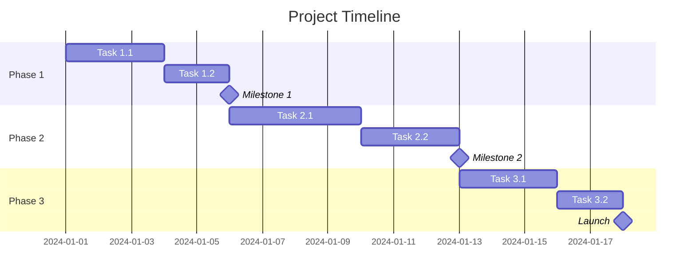

# [Project Name] Implementation Plan

**Created:** [Date]
**Author:** [Name]
**Version:** 1.0

---

## Executive Summary

[2-3 sentence overview of the project, its purpose, and expected outcome]

---

## 1. Goals & Objectives

### 1.1 Primary Goals
- [ ] [Goal 1]
- [ ] [Goal 2]
- [ ] [Goal 3]

### 1.2 Success Metrics

| Metric | Target | Current | Measurement Method |
|--------|--------|---------|-------------------|
| [Metric 1] | [Target] | [Baseline] | [How measured] |
| [Metric 2] | [Target] | [Baseline] | [How measured] |
| [Metric 3] | [Target] | [Baseline] | [How measured] |

### 1.3 Key Results
- KR1: [Measurable result]
- KR2: [Measurable result]
- KR3: [Measurable result]

---

## 2. Scope Definition

### 2.1 In Scope
- [Feature/Capability 1]
- [Feature/Capability 2]
- [Feature/Capability 3]

### 2.2 Out of Scope
- [Excluded item 1]
- [Excluded item 2]
- [Excluded item 3]

### 2.3 Assumptions
- [Assumption 1]
- [Assumption 2]
- [Assumption 3]

### 2.4 Constraints
- [Constraint 1]
- [Constraint 2]
- [Constraint 3]

---

## 3. Technical Overview

### 3.1 Architecture

```
[High-level architecture diagram or description]

┌─────────────┐     ┌─────────────┐     ┌─────────────┐
│   Frontend  │────▶│   Backend   │────▶│  Database   │
└─────────────┘     └─────────────┘     └─────────────┘
```

### 3.2 Technology Stack

| Layer | Technology | Version | Notes |
|-------|------------|---------|-------|
| Frontend | [Tech] | [Ver] | [Notes] |
| Backend | [Tech] | [Ver] | [Notes] |
| Database | [Tech] | [Ver] | [Notes] |
| Infrastructure | [Tech] | [Ver] | [Notes] |
| CI/CD | [Tech] | [Ver] | [Notes] |

### 3.3 Third-Party Dependencies
- [Dependency 1] - [Purpose]
- [Dependency 2] - [Purpose]
- [Dependency 3] - [Purpose]

---

## 4. Implementation Phases

### Phase 1: [Phase Name]
**Timeline:** [Start Date] - [End Date] ([X] days/weeks)
**Goal:** [What this phase accomplishes]

#### Milestones
- [ ] M1.1: [Milestone description] - [Target date]
- [ ] M1.2: [Milestone description] - [Target date]

#### Tasks

| ID | Task | Est. | Priority | Owner | Dependencies | Status |
|----|------|------|----------|-------|--------------|--------|
| 1.1 | [Task description] | [Xh] | High | [Name] | - | [ ] |
| 1.2 | [Task description] | [Xh] | High | [Name] | 1.1 | [ ] |
| 1.3 | [Task description] | [Xh] | Med | [Name] | 1.1 | [ ] |
| 1.4 | [Task description] | [Xh] | Med | [Name] | 1.2, 1.3 | [ ] |
| 1.5 | [Task description] | [Xh] | Low | [Name] | 1.4 | [ ] |

#### Deliverables
- [ ] [Deliverable 1]
- [ ] [Deliverable 2]
- [ ] [Deliverable 3]

#### Acceptance Criteria
- [ ] [Criterion 1]
- [ ] [Criterion 2]
- [ ] [Criterion 3]

#### Phase 1 Total: [X] hours

---

### Phase 2: [Phase Name]
**Timeline:** [Start Date] - [End Date] ([X] days/weeks)
**Goal:** [What this phase accomplishes]

#### Milestones
- [ ] M2.1: [Milestone description] - [Target date]
- [ ] M2.2: [Milestone description] - [Target date]

#### Tasks

| ID | Task | Est. | Priority | Owner | Dependencies | Status |
|----|------|------|----------|-------|--------------|--------|
| 2.1 | [Task description] | [Xh] | High | [Name] | Phase 1 | [ ] |
| 2.2 | [Task description] | [Xh] | High | [Name] | 2.1 | [ ] |
| 2.3 | [Task description] | [Xh] | Med | [Name] | 2.1 | [ ] |
| 2.4 | [Task description] | [Xh] | Med | [Name] | 2.2, 2.3 | [ ] |
| 2.5 | [Task description] | [Xh] | Low | [Name] | 2.4 | [ ] |

#### Deliverables
- [ ] [Deliverable 1]
- [ ] [Deliverable 2]

#### Acceptance Criteria
- [ ] [Criterion 1]
- [ ] [Criterion 2]

#### Phase 2 Total: [X] hours

---

### Phase 3: [Phase Name]
**Timeline:** [Start Date] - [End Date] ([X] days/weeks)
**Goal:** [What this phase accomplishes]

[Same structure as above]

---

## 5. Timeline Overview



### Summary

| Phase | Duration | Start | End |
|-------|----------|-------|-----|
| Phase 1 | [X] days | [Date] | [Date] |
| Phase 2 | [X] days | [Date] | [Date] |
| Phase 3 | [X] days | [Date] | [Date] |
| **Total** | **[X] days** | **[Date]** | **[Date]** |

---

## 6. Risk Assessment

| ID | Risk | Probability | Impact | Mitigation Strategy | Owner |
|----|------|-------------|--------|---------------------|-------|
| R1 | [Risk description] | High/Med/Low | High/Med/Low | [Mitigation plan] | [Name] |
| R2 | [Risk description] | High/Med/Low | High/Med/Low | [Mitigation plan] | [Name] |
| R3 | [Risk description] | High/Med/Low | High/Med/Low | [Mitigation plan] | [Name] |

### Contingency Plans

**If [Risk 1] occurs:**
1. [Action 1]
2. [Action 2]
3. [Action 3]

---

## 7. Resource Requirements

### 7.1 Team

| Role | Name/Count | Allocation | Duration |
|------|------------|------------|----------|
| [Role] | [Name/X people] | [X]% | [Duration] |
| [Role] | [Name/X people] | [X]% | [Duration] |

### 7.2 Infrastructure
- [Resource 1]
- [Resource 2]
- [Resource 3]

### 7.3 Budget

| Category | Estimated Cost | Notes |
|----------|---------------|-------|
| [Category] | $[Amount] | [Notes] |
| [Category] | $[Amount] | [Notes] |
| **Total** | **$[Amount]** | |

---

## 8. Quality Assurance

### 8.1 Testing Strategy
- Unit tests: [Coverage target]%
- Integration tests: [Approach]
- E2E tests: [Approach]
- Performance tests: [Approach]

### 8.2 Code Quality
- [ ] Code review required for all PRs
- [ ] Linting and formatting enforced
- [ ] Documentation requirements met
- [ ] Security scan passing

### 8.3 Definition of Done
- [ ] Code complete and reviewed
- [ ] Tests written and passing
- [ ] Documentation updated
- [ ] Deployed to staging
- [ ] QA sign-off received

---

## 9. Communication Plan

### 9.1 Stakeholders

| Stakeholder | Role | Communication | Frequency |
|-------------|------|---------------|-----------|
| [Name] | [Role] | [Email/Slack/Meeting] | [Daily/Weekly] |

### 9.2 Meetings
- **Daily standup:** [Time, attendees]
- **Weekly review:** [Time, attendees]
- **Sprint planning:** [Time, attendees]

### 9.3 Documentation
- Project docs: [Location]
- Technical docs: [Location]
- Meeting notes: [Location]

---

## 10. Open Questions

| # | Question | Owner | Due Date | Status |
|---|----------|-------|----------|--------|
| 1 | [Question] | [Name] | [Date] | Open/Resolved |
| 2 | [Question] | [Name] | [Date] | Open/Resolved |

---

## 11. Next Steps

### Immediate Actions (This Week)
1. [ ] [Action 1] - Owner: [Name]
2. [ ] [Action 2] - Owner: [Name]
3. [ ] [Action 3] - Owner: [Name]

### Upcoming Decisions
- [ ] [Decision needed] - Due: [Date]
- [ ] [Decision needed] - Due: [Date]

---

## Appendix

### A. Glossary
- **[Term]:** [Definition]
- **[Term]:** [Definition]

### B. References
- [Reference 1]
- [Reference 2]

### C. Change Log

| Version | Date | Author | Changes |
|---------|------|--------|---------|
| 1.0 | [Date] | [Name] | Initial version |

---

*This plan is a living document and will be updated as the project progresses.*
